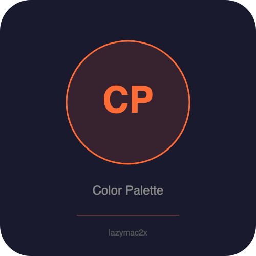

<p align="center"></p>

[](https://lazymac2x.github.io/lazymac-api-store/) [](https://coindany.gumroad.com/) [](https://mcpize.com/mcp/color-palette-api)

# color-palette-api

Color palette generation API — harmonies, gradients, contrast checking, WCAG accessibility scoring, CSS/Tailwind output. Zero external dependencies.

## Quick Start

```bash
npm install && npm start  # http://localhost:4000
```

## Endpoints

### Convert
```bash
curl http://localhost:4000/api/v1/convert/ff6b35
# → {"hex":"#ff6b35","rgb":{"r":255,"g":107,"b":53},"hsl":{"h":16,"s":100,"l":60}}
```

### Color Harmonies
```bash
# Types: complementary, analogous, triadic, split, tetradic, monochromatic
curl http://localhost:4000/api/v1/harmony/complementary/ff6b35
curl http://localhost:4000/api/v1/harmony/triadic/3498db
curl http://localhost:4000/api/v1/harmony/monochromatic/e74c3c?count=7
```

### Gradient
```bash
curl "http://localhost:4000/api/v1/gradient/ff6b35/3498db?steps=7"
# → colors array + CSS gradient string
```

### Contrast / WCAG Accessibility
```bash
curl http://localhost:4000/api/v1/contrast/000000/ffffff
# → {"ratio":21,"AA_normal":true,"AA_large":true,"AAA_normal":true,"AAA_large":true}

curl http://localhost:4000/api/v1/contrast/ff6b35/ffffff
# → Check if your orange text passes accessibility on white background
```

### Random Palette
```bash
curl "http://localhost:4000/api/v1/random?count=5"
```

### CSS Variables
```bash
curl -X POST http://localhost:4000/api/v1/css \
  -H "Content-Type: application/json" \
  -d '{"colors":["#ff6b35","#3498db","#2ecc71"], "name":"brand"}'
```

### Tailwind Config
```bash
curl -X POST http://localhost:4000/api/v1/tailwind \
  -H "Content-Type: application/json" \
  -d '{"colors":["#fef3c7","#fde68a","#fcd34d","#fbbf24","#f59e0b","#d97706","#b45309","#92400e","#78350f","#451a03"], "name":"amber"}'
```

## License
MIT
